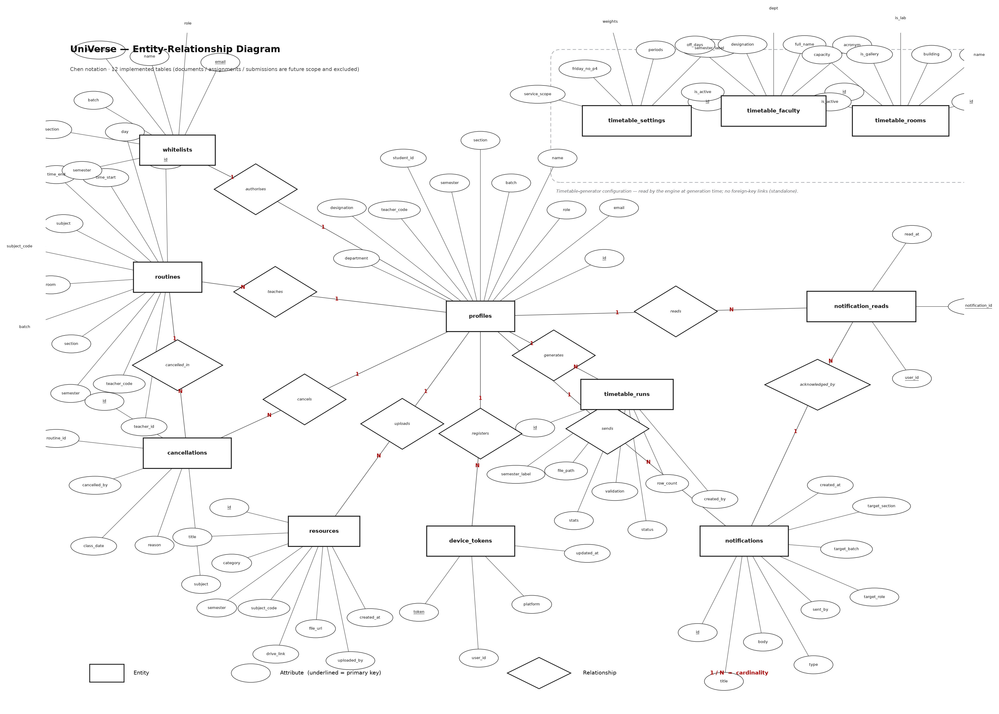
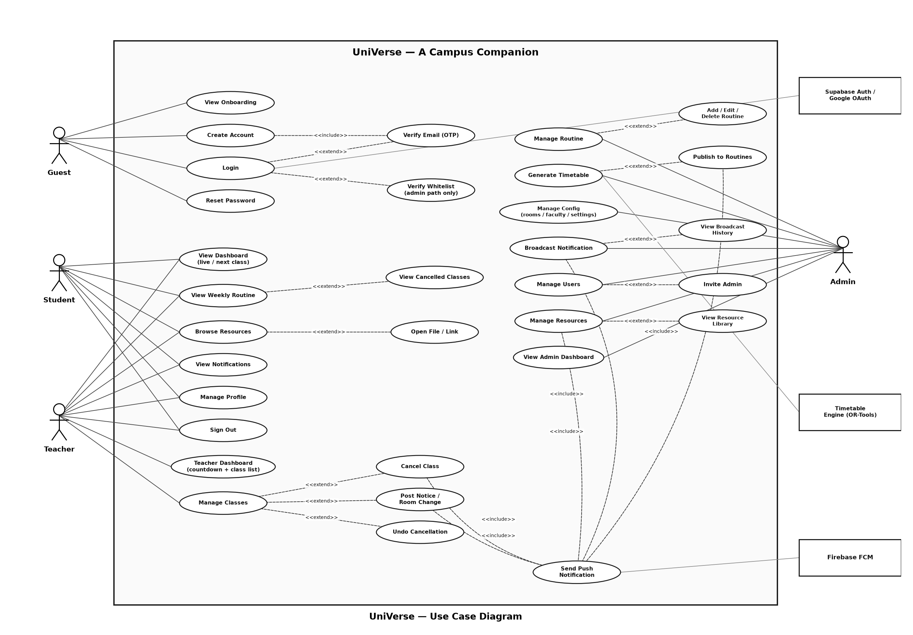
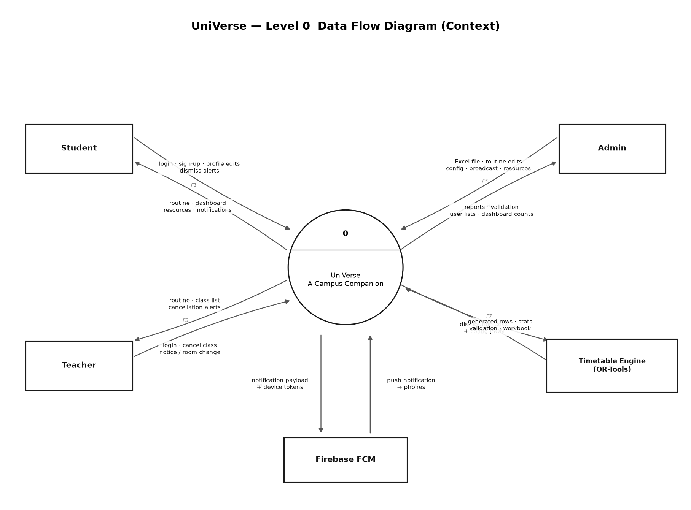
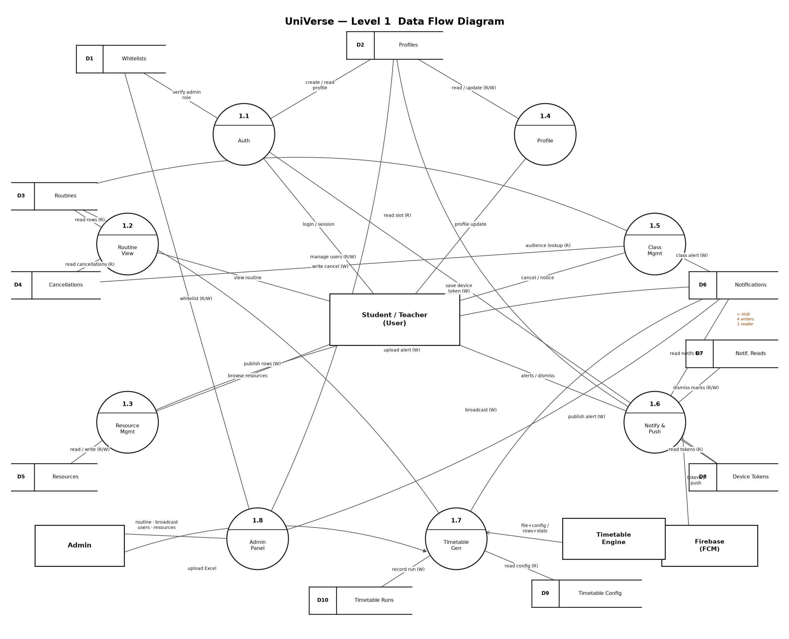

<div align="center">


# UniVerse — A Campus Companion

**A role-aware campus app for students, teachers, and admins — with an automatic department timetable generator at its core.**

[](https://flutter.dev)
[](https://dart.dev)
[](https://supabase.com)
[](https://firebase.google.com)
[](https://developers.google.com/optimization)
[](#)

</div>

---

## Overview

**UniVerse** is an Android app built for the CSE department of **Leading University, Sylhet,
Bangladesh**. It gives every actor on campus a single place to see their day: students and
teachers get a live dashboard of their classes; admins manage routines, resources, users, and
campus-wide broadcasts.

The headline feature is an **automatic timetable generator**. An admin uploads the semester's
course distribution workbook, and a Python **OR-Tools CP-SAT** engine solves a conflict-free
weekly schedule — respecting teacher day-offs, room pools, lab blocks, and department lab
reservations — then publishes it straight into the app for everyone to see.

> Course **CSE-3240 (Project I)** · Team **Sherlocked** · Advisor: **Jaminur Rahman**

---

## Feature highlights

### 🎓 Student
- **Dashboard** — greeting, a live/next-class hero card with a countdown, quick stats, and today's class list.
- **Routine** — the full weekly schedule, filtered to the student's batch and section.
- **Resources hub** — browse course material by **semester folder** and category; open files or Drive links.
- **Notifications** — a realtime feed with per-user multi-select dismiss.

### 👩‍🏫 Teacher
- **Dashboard** — same live hero + today's classes, from the teacher's perspective.
- **Manage Classes** — **cancel** a class occurrence (auto-alerts + pushes affected students), **post** a room change / notice / test reminder, or **undo** a cancellation.
- **Routine** — weekly schedule filtered by teacher code.

### 🛠️ Admin
- **Routine hub** — a segmented **Manage** + **Generate** view over the timetable engine.
- **Timetable generator** — upload a distribution workbook → review report, validation, and grid → download the `.xlsx` or publish to everyone.
- **Config** — Manage Rooms, Manage Faculty (with day-offs + course eligibility + course assignments), and Timetable Settings.
- **Broadcast** — send campus-wide notifications (with history), plus admin registration and user management.
- **Manage Resources** — upload any file or Drive link into semester folders (auto-notifies students).

### 🧭 Campus Explore *(all roles, via the "Explore Campus" FAB)*
- **Find Teacher** — real-time teacher locator: current room, remaining time, and next class.
- **Room Availability** — real-time room occupancy: current class, status, and countdown to free.

### 🔔 Push notifications
Any insert into the `notifications` table fires a deployed Supabase Edge Function
(`send-push`) via a DB webhook, delivering an OS push over **Firebase Cloud Messaging** to the
correct audience — no separate push path to maintain.

---

## The differentiator — Timetable Engine

The engine is a stateless **FastAPI + Google OR-Tools (CP-SAT)** service (in `engine/`),
deployed on Render. It turns an Excel course distribution into a conflict-free weekly workbook.

```
Excel distribution + DB config
   → ingest.py   parse the "Course Distribution" sheet, detect labs / service courses,
                 apply admin teacher overrides, validate invariants
   → solver.py   PHASE 1 (CP-SAT): assign every session a (day, period)
                 PHASE 2 (greedy):  assign a concrete room
   → render.py   write the canonical cohort grid into the routine template
   → app polls   → report + validation + grid → Download .xlsx / Publish to routines
```

**Hard constraints:** no teacher/section/room double-booking · teacher day-offs · Friday has no
period 4 · room count never exceeds the pool · department-tagged lab rooms reserved for that
department. **Soft goals:** spread a course's two weekly sessions across different days, keep
each cohort's day compact, and avoid the last period.

Published rows are shaped **exactly** like the Supabase `routines` table, so the existing
student/teacher routine screens display them with zero extra code.

> Real-data sanity check (Summer 2025): 358 offerings → 654 CSE + 32 service sessions across
> 55 cohorts and 76 teachers, solved clash-free.

See [engine/README.md](engine/README.md) for the full HTTP contract and local-run instructions.

---

## Tech stack

| Layer | Choice |
|---|---|
| **App** | Flutter ~3.35 · Dart `^3.9.2` |
| **State** | `ChangeNotifier` + `ListenableBuilder` (no Riverpod/Bloc/Provider) |
| **Routing** | `go_router` ^17 with a `ShellRoute` + role-aware bottom nav |
| **Backend** | Supabase — Postgres · Auth · Storage · Realtime |
| **Auth** | Google OAuth (PKCE) + email/password; whitelist gate for admins |
| **Push** | Firebase Cloud Messaging + a `send-push` Supabase Edge Function |
| **Engine** | Python 3.12 · FastAPI · Google OR-Tools (CP-SAT) · openpyxl |
| **UI** | Google Fonts (Inter) · Phosphor icons · a custom dark design system |

---

## Architecture

Layered, feature-first, and strictly enforced:

```
Screen  →  Controller (ChangeNotifier)  →  Service  →  Supabase / Engine
```

- **Screens and controllers never touch Supabase** — only the `services/` layer does.
- Each feature owns its own `screens/ controllers/ services/`.
- Shared design tokens live in `lib/core/theme/` — no hardcoded hex, spacing, or text styles in widgets.
- One `AppShell` owns the single Scaffold + bottom nav; secondary screens are pushed.

### Project layout

```
lib/
  main.dart                 Firebase + push init, Supabase init, router, deep links
  core/
    theme/  router/  constants/  models/  utils/  services/
  shared/widgets/           u_* primitives, composite cards, explore FAB menu
  features/
    auth/  routine/  resources/  notifications/  profile/  admin/
    dashboard/              student home
    teacher/               teacher home + Manage Classes
    find_teacher/          real-time teacher locator
    rooms/                 real-time room availability

engine/                     FastAPI + CP-SAT timetable service
supabase/
  migrations/               schema + RLS (001–010)
  functions/               invite-admin · send-push (Edge Functions)
  seed/                    demo accounts, routine, resources, timetable config
docs/                       diagrams + defense material
```

### Diagrams

| ER Diagram | Use Case | DFD (Level 0) | DFD (Level 1) |
|---|---|---|---|
| [](docs/diagrams/er-diagram.png) | [](docs/diagrams/use-case-diagram.png) | [](docs/diagrams/dfd-level-0.png) | [](docs/diagrams/dfd-level-1.png) |

Sources (Mermaid): [docs/diagrams/](docs/diagrams/).

---

## Getting started

### Prerequisites

- **Flutter** ~3.35 (Dart `^3.9.2`) — `flutter doctor` should pass for Android.
- **Android** SDK; **Gradle 8.14** wrapper (required for JDK 24 dev machines — do not downgrade).
- **Python 3.12** (only if you want to run the timetable engine locally).
- A **Supabase** project and a **Firebase** Android app (for push).

### 1. Clone and install

```bash
git clone <this-repo>
cd universe_v1
flutter pub get
```

### 2. Configure environment

The app reads its backend config from dart-defines. Copy the example and fill in your values:

```bash
cp dart_defines.example.json dart_defines.json
```

```jsonc
{
  "SUPABASE_URL": "https://YOUR_PROJECT.supabase.co",
  "SUPABASE_ANON_KEY": "YOUR_SUPABASE_ANON_KEY",
  "TIMETABLE_BASE_URL": "http://10.0.2.2:8000"   // emulator → host machine
}
```

> `dart_defines.json` is gitignored. The Supabase anon key is safe to ship; the **service-role
> key never leaves the `invite-admin` Edge Function**.

Firebase config (`google-services.json`, `firebase_options.dart`) is committed as Android client
config — it is not secret.

### 3. Run

```bash
flutter run --dart-define-from-file=dart_defines.json
```

### 4. Build a release APK

```bash
flutter build apk --release
# → build/app/outputs/flutter-apk/app-release.apk
```

The release APK uses debug signing so it is sideloadable for demos; the live engine URL is
baked in as a default in `app_constants.dart`.

---

## Backend setup (Supabase)

1. Apply the migrations in [supabase/migrations/](supabase/migrations/) (001 → 010) in order.
   They create the schema, enable RLS on every table, and add the timetable-config tables.
2. Seed demo data from [supabase/seed/](supabase/seed/) (accounts, routine, resources,
   notifications, whitelist, timetable config).
3. Deploy the Edge Functions in [supabase/functions/](supabase/functions/):
   - `invite-admin` — admin provisioning (holds the service-role key).
   - `send-push` — FCM v1 delivery, triggered by a DB webhook on `notifications` INSERT.
4. Create the storage buckets: `avatars`, `resources`, `assignments`, `timetables`.

**RLS pattern** on every table: `read_all` (SELECT) + `admin_write` (INSERT/UPDATE/DELETE with a
check that the caller is an admin in `profiles`).

---

## Running the timetable engine locally

```bash
cd engine
python -m venv .venv
# Windows:  .venv\Scripts\activate
# macOS/Linux:  source .venv/bin/activate
pip install -r requirements.txt

# Quick standalone solve (prints stats + validation, no server):
python solver.py

# Start the API:
uvicorn main:app --reload --port 8000
```

Point the app at it with `TIMETABLE_BASE_URL=http://10.0.2.2:8000` (Android emulator → host).
Deployment is automatic: pushing to `main` triggers a Render rebuild via [render.yaml](render.yaml).

---

## Design system

A single dark theme (`AppTheme.dark`) built from tokens in `lib/core/theme/`:

- **Colors** — deep charcoal surfaces with an orange (`#FF7A00`) primary accent.
- **Type** — Inter via Google Fonts; a fixed scale (`h1`…`caption`, `button`, `countdown`, …).
- **Spacing / radius / icons** — named tokens only; never raw numbers in widgets.
- **Icons** — Phosphor (`PhosphorIconsRegular.*`).

---

## Team — Sherlocked

Feature-based vertical ownership (screen + controller + service):

| Member | Ownership |
|---|---|
| **Fahmid Alam** | Architecture, shared infra, auth, admin + **timetable engine**, `core/`, build/deploy |
| **Swadheen Islam Robi** | Student/teacher features — routine, resources, dashboards, teacher screens, Find Teacher, Room Availability |
| **Shahriar Rashid Ratul** | Notifications, profile, push, QA, seeding, docs |

---

## Project status

Feature-complete and defense-ready. The app runs end-to-end: auth · dashboards · routine ·
resources · notifications with live push · profile · admin · teacher Manage Classes ·
**automatic timetable generator (deployed live)** · Find Teacher + Room Availability.

An in-app AI assistant is intentionally **descoped** (kept as future scope).

---

## License

Academic project for CSE-3240 (Project I) at Leading University. Not licensed for redistribution.
