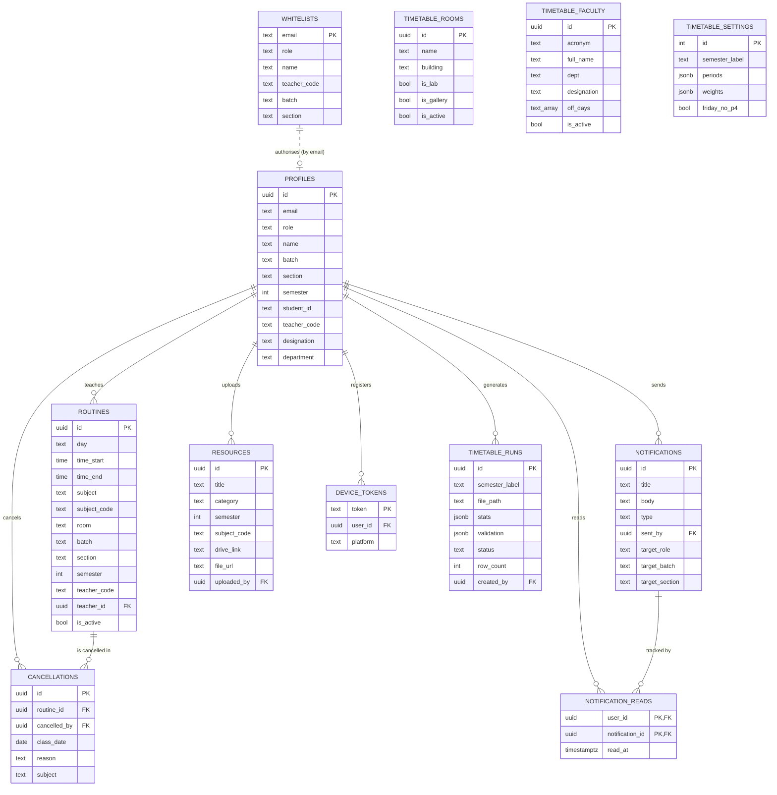

# Diagram 1 — Entity-Relationship (ER) Diagram

> **What this shows:** the database design — every table the app uses (an *entity*), its
> attributes, and how the tables connect to each other through foreign keys (the *relationships*).
>
> **Tool to use:** dbdiagram.io (best looking) or mermaid.live (fastest). Both code blocks below
> produce the same diagram.

---

## 1. Which entities to draw (and which to skip)

Draw exactly these **12 entities**. Do **NOT** draw `documents`, `assignments`, or `submissions`
— those are future-scope tables the app never uses (see [README.md](README.md)).

| # | Entity (table) | What it stores in one line |
|---|---|---|
| 1 | **profiles** | One row per registered person (student / teacher / admin). The central "user" entity. |
| 2 | **whitelists** | The list of emails pre-authorised to become an **admin**. |
| 3 | **routines** | The weekly class schedule — one row per class slot (day + time + subject + room). |
| 4 | **cancellations** | One row per cancelled class occurrence (a specific date). |
| 5 | **notifications** | Every alert/broadcast (cancellations, room changes, campus news, etc.). |
| 6 | **notification_reads** | Which user has read which notification (a link table). |
| 7 | **resources** | Study materials — uploaded files and Google Drive links, per semester. |
| 8 | **device_tokens** | Each phone's push-notification token, per user (for FCM). |
| 9 | **timetable_rooms** | The pool of rooms the timetable generator can assign. |
| 10 | **timetable_faculty** | The teacher directory the generator uses (acronyms, off-days). |
| 11 | **timetable_settings** | A single config row for the generator (periods, weights, etc.). |
| 12 | **timetable_runs** | A history log — one row each time a timetable is generated/published. |

> **Note about `auth.users`:** Supabase keeps the real login identity in a system table called
> `auth.users`, and `profiles` mirrors it 1-to-1 (same `id`). To keep the diagram clean and
> understandable, **treat `profiles` as the single "user" entity** and add a caption:
> *"profiles.id = auth.users.id (managed by Supabase Auth)."* Do not draw a second user table.

---

## 2. Attributes of each entity

List these attributes inside each entity box. **PK** = Primary Key, **FK** = Foreign Key.
(Only the meaningful columns are listed; you may show all or trim to these.)

### profiles  *(the user)*
- **id** (uuid, PK) — equals the Supabase auth user id
- email (text)
- role (text: student / teacher / admin)
- name (text)
- avatar_url (text)
- batch (text) · section (text) · semester (int) — for students
- student_id (text) — for students
- teacher_code (text) — for teachers
- designation (text) · department (text) — for teachers
- created_at (timestamp)

### whitelists  *(admin gate; keyed by email, not id)*
- **email** (text, PK)
- role (text: student / teacher / admin)
- name (text)
- teacher_code (text) · batch (text) · section (text) · semester (int)

### routines
- **id** (uuid, PK)
- day (text: Sunday … Saturday)
- time_start (time) · time_end (time)
- subject (text) · subject_code (text)
- room (text)
- batch (text) · section (text) · semester (int)
- teacher_name (text) · teacher_code (text)
- **teacher_id** (uuid, FK → profiles.id)  *(nullable)*
- is_active (boolean)

### cancellations
- **id** (uuid, PK)
- **routine_id** (uuid, FK → routines.id)
- **cancelled_by** (uuid, FK → profiles.id)
- class_date (date) — the specific day the class is cancelled
- reason (text)
- batch · section · subject · day · time_start (denormalised copies for display)
- created_at (timestamp)

### notifications
- **id** (uuid, PK)
- title (text) · body (text)
- type (text: university / class_cancel / room_change / test_reminder / assignment / exam)
- **sent_by** (uuid, FK → profiles.id)  *(nullable)*
- target_role (text) · target_batch (text) · target_section (text)  *(null = everyone)*
- created_at (timestamp)

### notification_reads  *(link / junction table)*
- **user_id** (uuid, PK, FK → profiles.id)
- **notification_id** (uuid, PK, FK → notifications.id)
- read_at (timestamp)
- *(composite primary key = user_id + notification_id)*

### resources
- **id** (uuid, PK)
- title (text)
- category (text: PYQ / Notes / Slides / Assignments)
- semester (int)
- subject_code (text)
- drive_link (text) · file_url (text)
- **uploaded_by** (uuid, FK → profiles.id)
- created_at (timestamp)

### device_tokens
- **token** (text, PK) — the FCM token
- **user_id** (uuid, FK → profiles.id)
- platform (text, default 'android')
- updated_at (timestamp)

### timetable_rooms
- **id** (uuid, PK)
- name (text, unique) · building (text)
- is_lab (boolean) · is_gallery (boolean)
- capacity (int) · is_active (boolean)

### timetable_faculty
- **id** (uuid, PK)
- acronym (text, unique) · full_name (text)
- dept (text) · designation (text)
- off_days (text array) — days the teacher is unavailable
- is_active (boolean)

### timetable_settings  *(only one row ever; id is always 1)*
- **id** (int, PK, always = 1)
- semester_label (text)
- periods (jsonb) · weights (jsonb)
- friday_no_p4 (boolean)
- service_scope (text)

### timetable_runs
- **id** (uuid, PK)
- semester_label (text)
- file_path (text) — where the generated Excel file is stored
- stats (jsonb) · validation (jsonb)
- status (text: generated / published)
- row_count (int)
- **created_by** (uuid, FK → profiles.id)
- created_at (timestamp)

---

## 3. Relationships — the exact connections (from → to)

Every line below is a **real foreign key**. Use this one rule to draw each line correctly:

> **The foreign-key column lives in the CHILD table and points to the PARENT's `id`.**
> Put the **crow's foot (the "many" / `N` mark) at the CHILD end**, and the **single bar (`1`)
> at the PARENT end**. So the line literally goes *child.fk_column → parent.id*.

| # | Parent ( "1" end, bar ) | Child ( "N" end, crow's foot ) | Exact FK column → target | Verb on the line | Read it as |
|---|---|---|---|---|---|
| **R1** | profiles | routines | `routines.teacher_id` → `profiles.id` | **teaches** | one teacher appears on many routine rows |
| **R2** | profiles | cancellations | `cancellations.cancelled_by` → `profiles.id` | **cancels** | one user cancels many class occurrences |
| **R3** | profiles | notifications | `notifications.sent_by` → `profiles.id` | **sends** | one user sends many notifications |
| **R4** | profiles | resources | `resources.uploaded_by` → `profiles.id` | **uploads** | one user uploads many resources |
| **R5** | profiles | device_tokens | `device_tokens.user_id` → `profiles.id` | **registers** | one user registers many devices |
| **R6** | profiles | timetable_runs | `timetable_runs.created_by` → `profiles.id` | **generates** | one admin generates many timetable runs |
| **R7** | profiles | notification_reads | `notification_reads.user_id` → `profiles.id` | **reads** | one user has many read-marks |
| **R8** | routines | cancellations | `cancellations.routine_id` → `routines.id` | **is cancelled in** | one class slot is cancelled on many dates |
| **R9** | notifications | notification_reads | `notification_reads.notification_id` → `notifications.id` | **is read in** | one notification has many read-marks |
| **R10** | whitelists | profiles | matched by **email** — *no FK column* | **authorises** | one whitelist entry authorises one profile |

That is **10 lines total** — and only **8 boxes** carry lines (profiles, whitelists, routines,
cancellations, notifications, notification_reads, resources, device_tokens, timetable_runs).

**Two boxes have TWO parents each — draw both lines into them:**
- `cancellations` ← from **profiles** (R2) **and** from **routines** (R8).
- `notification_reads` ← from **profiles** (R7) **and** from **notifications** (R9). This is the
  **junction / associative entity** that resolves the many-to-many between users and
  notifications (one notification → many users; one user → many notifications). **Say this in the
  defense** — examiners look for it. Its primary key is the *pair* (`user_id` + `notification_id`).

**Standalone boxes (draw them, but with NO lines):** `timetable_rooms`, `timetable_faculty`,
`timetable_settings`. They have no foreign keys — the timetable engine just reads them as config.
Group them in a corner with the caption *"Config tables — read by the timetable engine; no FK links."*
R10 (whitelists → profiles) has **no FK** either; draw it as a **dashed** line labelled
*"by email"* so it's clearly a logical, not enforced, link.

---

## 3b. Placement plan (draw it like this so it isn't messy)

```
          whitelists ----dashed("by email")----  (R10)
              \                                    \
   routines    \                                    timetable_runs
      │  \(R8)  \                                   /(R6)
      │   cancellations                            /
      │(R1)        ╲(R2)                          /
      └────────────► P R O F I L E S ◄───────────┘
              (R4)/   (R3)│   \(R5)   \(R7)
                /         │    \        \
          resources   notifications  device_tokens   notification_reads
                            │(R9)                      ▲
                            └──────────────────────────┘

   ┌─ corner box (no lines): timetable_rooms · timetable_faculty · timetable_settings ─┐
```

- **profiles in the dead centre** — 7 lines fan out from it (R1–R7).
- Put **cancellations between profiles and routines** (it links to both — R2 & R8).
- Put **notification_reads between profiles and notifications** (R7 & R9).
- Each entity's **attribute ellipses** point *outward, away from the centre*, so they never cross
  the relationship lines. Primary-key attributes are **underlined**.
- The 3 config tables sit alone in a corner.

---

## 4. Ready-to-render code

### Option A — Mermaid (paste into https://mermaid.live)



### Option B — DBML (paste into https://dbdiagram.io, exports a cleaner PDF)

```dbml
Table profiles {
  id uuid [pk, note: 'equals auth.users.id']
  email text
  role text
  name text
  avatar_url text
  batch text
  section text
  semester int
  student_id text
  teacher_code text
  designation text
  department text
  created_at timestamptz
}

Table whitelists {
  email text [pk]
  role text
  name text
  teacher_code text
  batch text
  section text
  semester int
}

Table routines {
  id uuid [pk]
  day text
  time_start time
  time_end time
  subject text
  subject_code text
  room text
  batch text
  section text
  semester int
  teacher_name text
  teacher_code text
  teacher_id uuid [ref: > profiles.id]
  is_active bool
}

Table cancellations {
  id uuid [pk]
  routine_id uuid [ref: > routines.id]
  cancelled_by uuid [ref: > profiles.id]
  class_date date
  reason text
  batch text
  section text
  subject text
  day text
  time_start text
  created_at timestamptz
}

Table notifications {
  id uuid [pk]
  title text
  body text
  type text
  sent_by uuid [ref: > profiles.id]
  target_role text
  target_batch text
  target_section text
  created_at timestamptz
}

Table notification_reads {
  user_id uuid [ref: > profiles.id]
  notification_id uuid [ref: > notifications.id]
  read_at timestamptz
  indexes {
    (user_id, notification_id) [pk]
  }
}

Table resources {
  id uuid [pk]
  title text
  category text
  semester int
  subject_code text
  drive_link text
  file_url text
  uploaded_by uuid [ref: > profiles.id]
  created_at timestamptz
}

Table device_tokens {
  token text [pk]
  user_id uuid [ref: > profiles.id]
  platform text
  updated_at timestamptz
}

Table timetable_rooms {
  id uuid [pk]
  name text [unique]
  building text
  is_lab bool
  is_gallery bool
  capacity int
  is_active bool
}

Table timetable_faculty {
  id uuid [pk]
  acronym text [unique]
  full_name text
  dept text
  designation text
  off_days "text[]"
  is_active bool
}

Table timetable_settings {
  id int [pk, note: 'always 1 (single row)']
  semester_label text
  periods jsonb
  weights jsonb
  friday_no_p4 bool
  service_scope text
}

Table timetable_runs {
  id uuid [pk]
  semester_label text
  file_path text
  stats jsonb
  validation jsonb
  status text
  row_count int
  created_by uuid [ref: > profiles.id]
  created_at timestamptz
}
```

---

## 5. Don't-skip checklist

- [ ] Exactly **12 entities** drawn (no `documents` / `assignments` / `submissions`).
- [ ] `profiles` is shown as the central user entity, connected to 7 children.
- [ ] All **10 relationship lines** from the table in §3 are present.
- [ ] `notification_reads` is shown with a **composite primary key** (both columns marked PK).
- [ ] The 3 `timetable_*` config tables are present even though they have no lines.
- [ ] Crow's-foot / cardinality marks show "1 — many" on each relationship.
- [ ] Caption added: *"profiles.id = auth.users.id (Supabase Auth)"* and the config-table note.
- [ ] Foreign-key columns marked **FK** (teacher_id, routine_id, cancelled_by, sent_by,
      uploaded_by, user_id, notification_id, created_by).
