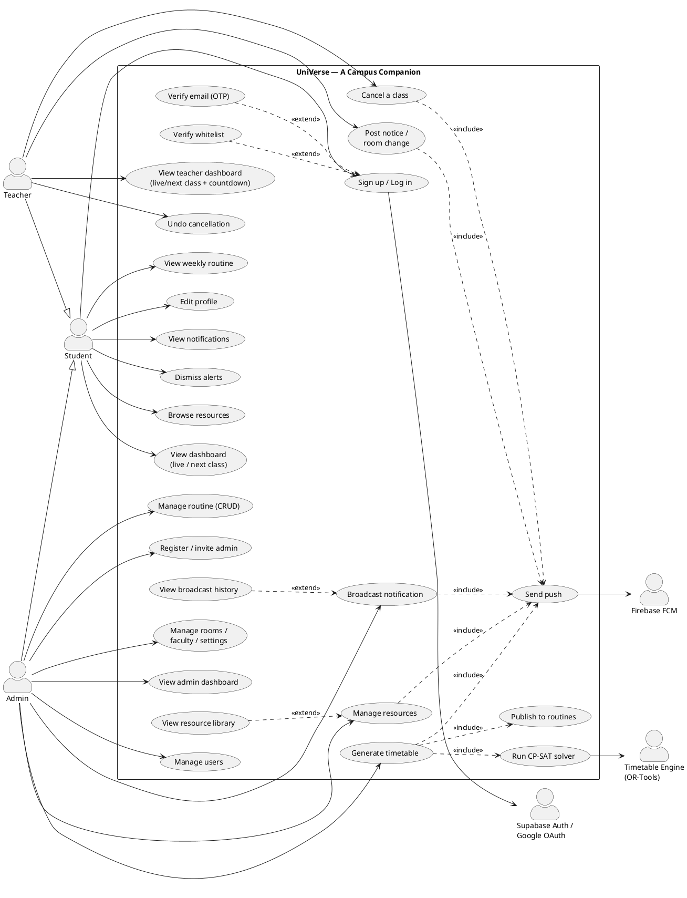

# Diagram 2 — Use Case Diagram

> **What this shows:** who uses the system (*actors*) and what they can do (*use cases*),
> plus the external systems the app depends on. This is the "features at a glance" diagram.
>
> **Tool to use:** PlantUML (best for proper use-case ovals + actors). Code is at the bottom.

---

## 1. Actors

### Primary actors (the people who use the app) — drawn on the LEFT
| Actor | Who they are |
|---|---|
| **Student** | A registered student. Sees their routine, dashboard, resources, alerts. |
| **Teacher** | A registered teacher. Sees their classes; can cancel/notify classes. |
| **Admin** | Department staff. Manages routines, generates timetables, broadcasts, users, resources. |

> **Generalisation:** Teacher and Admin can do everything a Student can (log in, view profile,
> view notifications). Draw a hollow-triangle inheritance arrow from **Teacher → Student** and
> **Admin → Student** so you don't repeat the shared use cases three times. (If your examiner
> prefers it flat, just connect the shared use cases to all three actors instead.)

### Secondary actors (external systems the app talks to) — drawn on the RIGHT
| Actor | Role |
|---|---|
| **Supabase Auth / Google OAuth** | Verifies identity during login/sign-up. |
| **Timetable Engine (OR-Tools)** | The Python solver that generates the class timetable. |
| **Firebase FCM** | Delivers push notifications to phones. |

---

## 2. Use cases (the ovals)

### Common — available to ALL roles (Student, Teacher, Admin)
1. **Sign up / Log in** (Google OAuth or email + password)
2. **Verify email** (6-digit code) *(extends Log in for the email path)*
3. **Edit profile**
4. **View notifications / alerts**
5. **Dismiss alerts** (hide read notifications)

### Student
6. **View weekly routine** (their class schedule)
7. **View dashboard** (live class / next class with countdown, today's classes, stats)
8. **Browse resources** (by semester folder, then open file or Drive link)

### Teacher  *(in addition to all Common + the routine/dashboard views)*
9. **View teacher dashboard** (live / next class countdown, today's class list, recent alerts)
10. **Cancel a class** (pick an occurrence, give a reason)
11. **Post a notice / room change / test reminder** (to the class's students)
12. **Undo a cancellation**

### Admin
13. **Manage routine** (create / edit / delete routine rows by hand)
14. **Generate timetable** (upload the Excel distribution file → run the engine → review → publish)
15. **Manage rooms / faculty / settings** (configure the timetable generator)
16. **Broadcast notification** (campus-wide or targeted announcement)
17. **View broadcast history** (list of all past broadcasts)
18. **Register / invite admin** (add an email to the whitelist + send an invite)
19. **Manage users** (view all users, change a user's role)
20. **Manage resources** (upload files / Drive links, delete resources)
21. **View resource library** (list of all uploaded resources + delete)
22. **View admin dashboard** (counts of users / routines / broadcasts)

---

## 3. Relationships between use cases (`<<include>>` / `<<extend>>`)

These dashed arrows make the diagram accurate and impress examiners. Draw them as dashed lines
labelled with the stereotype.

| Relationship | Type | Why |
|---|---|---|
| Log in **→ Verify whitelist** | `<<extend>>` | Only the *admin* login path checks the whitelist; students/teachers skip it. |
| Log in **→ Verify email** | `<<extend>>` | Only the email/password path needs OTP verification. |
| Generate timetable **→ Run CP-SAT solver** | `<<include>>` | Generating always calls the Timetable Engine. |
| Generate timetable **→ Publish to routines** | `<<include>>` | Publishing writes the result into the live routine. |
| Generate timetable **→ Send push** | `<<include>>` | Publishing a routine always sends a "routine published" alert to everyone. |
| Cancel a class **→ Send push** | `<<include>>` | Cancelling always alerts the students. |
| Post notice / room change **→ Send push** | `<<include>>` | Posting always alerts the students. |
| Broadcast notification **→ Send push** | `<<include>>` | Broadcasting always pushes to the audience. |
| Manage resources (upload) **→ Send push** | `<<include>>` | Uploading a resource alerts the students. |
| View broadcast history **→ Broadcast notification** | `<<extend>>` | History is a sub-screen opened from the broadcast form. |
| View resource library **→ Manage resources** | `<<extend>>` | Resource library is a sub-screen opened from the upload form. |

> **"Send push"** is a shared sub-use-case connected to the **Firebase FCM** actor. Drawing it
> once and pointing four use cases at it visually proves the system's signature rule:
> *every notification created in the app automatically becomes a phone push.*

Actor-to-external-system links:
- **Log in** ↔ **Supabase Auth / Google OAuth**
- **Generate timetable** ↔ **Timetable Engine (OR-Tools)**
- **Send push** ↔ **Firebase FCM**

---

## 4. Ready-to-render code — PlantUML

Paste everything from `@startuml` to `@enduml` into <https://www.plantuml.com/plantuml/uml>
(or the VS Code PlantUML extension).

---

## 5. Don't-skip checklist

- [ ] 3 primary actors (Student, Teacher, Admin) on the left; 3 system actors on the right.
- [ ] Teacher and Admin inherit from Student (generalisation arrows).
- [ ] All **22 use cases** from §2 are present.
- [ ] Both `<<extend>>` arrows (verify email, verify whitelist) drawn from Login.
- [ ] All **five** `<<include>> Send push` arrows: cancel, notice, broadcast, resource upload, **routine publish**.
- [ ] `Generate timetable` includes **Run solver**, **Publish to routines**, and **Send push**.
- [ ] `View broadcast history` extends `Broadcast notification` (sub-screen).
- [ ] `View resource library` extends `Manage resources` (sub-screen).
- [ ] External systems connected: Login→Auth, Solver→Engine, Send push→FCM.
- [ ] Everything sits inside one labelled system boundary box ("UniVerse — A Campus Companion").
